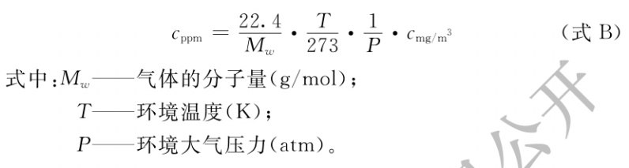
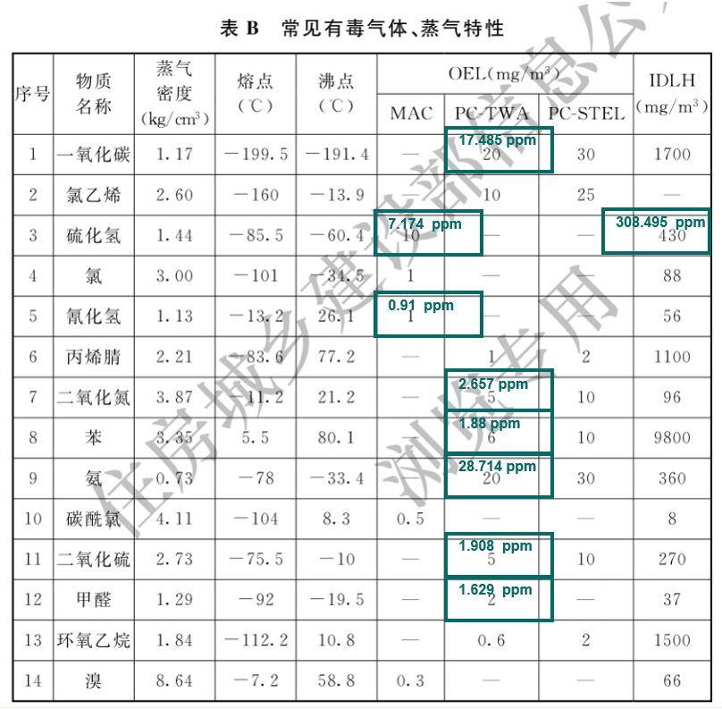

# GDS系统知识点

附PPT下载文件：[GDS系统知识点.pptx](https://www.kdocs.cn/l/cu55kei4hqxp)

GDS系统全称是气体检测系统，我们主要做的是可燃和有毒气体的检测，常见的检测气体有甲烷CH4，硫化氢H2S，氰化氢HCN,氨气NH3等，主要由前端探测器+后端控制器构成，传输方式有4-20ma，RS485两种方式，搭建上位机管理平台就可以监控了，这个文档是结合国家标准整理出来的相关知识点。

## 对安装位置的要求

> 4.1.3
> 下列可燃气体和（或）有毒气体释放源周围应布置检测点∶
>
> **1 气体压缩机和液体泵的动密封;**
>
> **2 液体采样口和气体采样口;**
>
> **3 液体（气体）排液（水）口和放空口;**
>
> **4 经常拆卸的法兰和经常操作的阀门组。**
>
> 4.1.4 检测可燃气体和有毒气体时，探测器探头应靠近释放源，且在气体、蒸气易于聚集的地点。
> 4.1.5 当生产设施及储运设施区域内泄漏的可燃气体和有毒气体可能对周边环境安全有影响需要监测时，应沿生产设施及储运设施区域周边按适宜的间隔布置可燃气体探测器或有毒气体探测器，或沿生产设施及储运设施区域周边设置线型气体探测器。

## 对环境中氧气的要求

> 4.1.6 在生产过程中可能导致环境氧气浓度变化，出现欠氧、过氧的有人员进入活动的场所，应设置氧气探测器。当相关气体释放源为可燃气体或有毒气体释放源时，氧气探测器可与相关的可燃气体探测器、有毒气体探测器布置在一起。

## 探测器的布置

标准中规定：

**1、储罐，可燃≤10m，有毒≤4m**

**2、灌装口排水口5m~7.5m，储瓶库15m~20m**

**3、仓库室外，可燃≤10m，有毒≤4m**

**4、仓库室内，可燃≤5m，有毒≤2m**

> 4.2 生 产设 施
> 4.2.1 释放源处于露天或敞开式厂房布置的设备区域内，可燃气体探测器距其所覆盖范围内的任一释放源的水平距离不宜大于10m，有毒气体探测器距其所覆盖范围内的任一释放源的水平距离不宜大于4m。
> 4.2.2 释放源处于封闭式厂房或局部通风不良的半敞开厂房内，可燃气体探测器距其所覆盖范围内的任一释放源的水平距离不宜大于5m;有毒气体探测器距其所覆盖范围内的任一释放源的水平距离不宜大于2m。
>
> 4.3 储 运 设 施
> 4.3.1 液化烃、甲B、乙A类液体等产生可燃气体的液体储罐的防火堤内，应设探测器。可燃气体探测器距其所覆盖范围内的任一释放源的水平距离不宜大于10m，有毒气体探测器距其所覆盖范围内的任一释放源的水平距离不宜大于 4m。
>
> 4.3.4 液化烃灌装站的探测器设置，应符合下列规定∶
> 1 封闭或半敞开的灌瓶间，灌装口与探测器的水平距离宜为5m～7.5m;
> 2 封闭或半敞开式储瓶库，应符合本标准第4.2.2条规定;敞开式储瓶库房沿四周每隔 15m~20m 应设一台探测器，当四周边长总和小于15m 时，应设一台探测器;
> 3 缓冲罐排水 口 或阀组与探测器的水平距 离宜为5m～7.5m。

##  探测器安装高度确定

不同探测器安装高度确定

| 名称            | 分子质量 | 相对空气比值 | 《标准》中重量定性 | 《标准》中规定探测器规定安装高度 | 参考安装高度 |
| --------------- | -------- | ------------ | ------------------ | -------------------------------- | ------------ |
| 空气            | 29       | 1.00         | 等重空气           |                                  |              |
| H2S（硫化氢）   | 34       | 1.17         | 略重于空气         | 释放源下方0.5m~1m                | 0.35m        |
| SO2（二氧化硫） | 64       | 2.21         | 重于空气           | 距地板0.3m~0.6m                  | 0.35m        |
| NH4（甲烷）     | 18       | 0.62         | 轻于空气           | 释放源上方2m内                   |              |
| NH3（氨气）     | 17       | 0.59         | 轻于空气           | 释放源上方2m内                   |              |
| HCL（氯化氢）   | 36.5     | 1.26         | 重于空气           | 距地板0.3m~0.6m                  | 0.35m        |
| HCN（氰化氢）   | 27       | 0.93         | 略轻于空气         | 释放源上方0.5m~1m                |              |
| NO2（二氧化氮） | 46       | 1.59         | 重于空气           | 距地板0.3m~0.6m                  | 0.35m        |
| CO（一氧化碳）  | 28       | 0.97         | 略轻于空气         | 释放源上方0.5m~1m                |              |
| O2（氧气）      | 32       | 1.10         | 略重于空气         | 距地板1.5m~2m                    | 1.5m         |
| C6H6（苯）      | 78       | 2.69         | 重于空气           | 距地板0.3m~0.6m                  | 0.35m        |

> 4.1 一般 规定
> 4.1.1 可燃气体和有毒气体探测器的检测点，应根据气体的理化性质、释放源的特性、生产场地布置、地理条件、环境气候、探测器的特点、检测报警可靠性要求、操作巡检路线等因素进行综合分析，选择可燃气体及有毒气体容易积聚、便于采样检测和仪表维护之处布置。
> 4.1.2 判别泄漏气体介质是否比空气重，应以泄漏气体介质的分子量与环境空气的分子量的比值为基准，并应按下列原则判别∶
> 1 当比值大于或等手1.2时，则泄漏的气体重于空气;2 当比值大于或等于1.0、小于1.2时，则泄漏的气体为略重于空气;
> 3 当比值为0.8～1.0时，则泄漏的气体为略轻于空气;4 当比值小于或等于 0.8时，则泄漏的气体为轻于空气。
>
> 6.1 探测器安装
> 6.1.1 探测器应安装在无冲击、无振动、无强电磁场干扰、易于检修的场所，探测器安装地点与周边工艺管道或设备之间的净空不应小于0.5m。
> 6.1.2 检测比空气重的可燃气体或有毒气体时，探测器的安装高度宜距地坪（或楼地板）0.3m～0.6m;检测比空气轻的可燃气体或有毒气体时，探测器的安装高度宜在释放源上方 2.0m 内。检测比空气略重的可燃气体或有毒气体时，探测器的安装高度宜在释放源下方0.5m～1.0m;检测比空气略轻的可燃气体或有毒气体时，探测器的安装高度宜高出释放源 0.5m～1.0m。
> 6.1.3 环境氧气探测器的安装高度宜距地坪或楼地板1.5m～2.0m。
> 6.1.4 线型可燃气体探测器宜安装于大空间开放环境，其检测区域长度不宜大于100m。

## 报警值设定

标准中规定：

1、对探测器测量范围的要求

> 5.5.1 测量范围应符合下列规定∶
> 1 可燃气体的测量范围应为0~100%LEL;
> 2 有毒气体的测量范围应为0～300%OEL;当现有探测器的测量范围不能满足上述要求时，有毒气体的测量范围可为0～30%IDLH;环境氧气的测量范围可为0～25%VOL∶
> 3 线型可燃气体测量范围为0～5LEL·m。

2、可燃气体报警值设定（如CH4）

**一级报警≤25%LEL**

**二级报警≤50%LEL**

有毒气体报警值设定

（如H2S，计算方式详见单位换算）

**一级报警≤ 100%OEL，即≤7ppm**

**二级报警≤ 200%OEL，即≤14ppm**

> 5.5.2 报警值设定应符合下列规定∶
> 1 可燃气体的一级报警设定值应小于或等于25%LEL。
> 2 可燃气体的二级报警设定值应小于或等于 50%LEL。
> 3 有毒气体的一级报警设定值应小于或等于100%OEL，有毒气体的二级报警设定值应小于或等于200%OEL。当现有探测器的测量范围不能满足测量要求时，有毒气体的一级报警设定值不得超过5%IDLH，有毒气体的二级报警设定值不得超过10%IDLH。
> 4 环境氧气的过氧报警设定值宜为 23.5%VOL，环境欠氧报警设定值宜为 19.5%VOL。
> 5 线型可燃气体测量一级报警设定值应为1LEL·m;二级报警设定值应为2LEL·m。

## 名词解释

LEL指可燃气体发生爆炸时的下限浓度值，如可燃气体一级报警值设置为25%LEL，意思是当可燃气体浓度达到下限值25%就报警。

OEL是职业接解限值，意思是在这个值范围内工作，不会对健康造成损害。

IDLH是直接致害浓度，意思是当达到这个值时非常危险，会对健康造成永久伤害或丧生。

> 2.0.12 爆炸下限
> lower explosion limit(LEL)
> 可燃气体发生爆炸时的下限浓度（V%）值。
>
> 2.0.13～爆炸上限
> upper explosion limit( UEL)
> 可燃气体发生爆炸时的上限浓度（V%）值。
>
> 2.0.14 职业接触限值
> occupational exposure limit(OEL)一
> 劳动者在职业活动中长期反复接触，不会对绝大多数接触者的健康引起有害作用的容许接触水平。化学因素的职业接触限值分为最高容许浓度、短时间接触容许浓度和时间加权平均容许浓度三种。
>
> 2.0.15 最高容许浓度
> maximum allowable concentration
> (MAC)
> 工作地点在一个工作日内、任何时间有毒化学物质均不应超过的浓度。
>
> 2.0.16 时间加权平均容许浓度pcrmissible conccntration-
> time weighted average(PC-TWA)
> 以时间为权数规定的 8h 工作日、40h 工作周的平均容许接触浓度。
>
> 2.0.17 短时间接触容许浓度permissible concentration-
> short term exposure limit(PC-STEL)
> 在遵守时间加权平均容许浓度（PC-TWA）前提下容许短时间（15min）接触的浓度。
>
> 2.0.18 直接致害浓度
> immediately dangerous to life or health concentration(IDLH)
> 在工作地点，环境中空气污染物浓度达到某种危险水平，如可致命或永久损害健康，或使人立即丧失逃生能力。

## 报警值设定（单位换算）

“设计标准”中有毒气体OEL和IDLH值，单位是mg/m³，绿色值是换算出的ppm值。

可以通过在线网站换算

https://www.teesing.com/tw/page/資訊中心/工具/ppm-mg-m3

https://www.osgeo.cn/app/s1900

也可能通过公式换算

> 式中
>
> Mw—气体的分子量（g/mol)；
>
> T—环境温度（K)；
>
> P—环境大气压力（atm)；

附表

